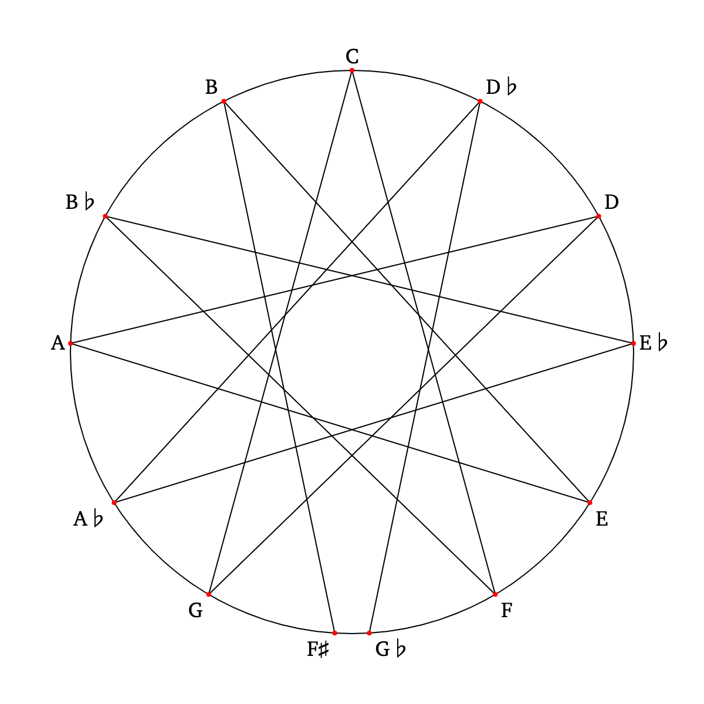
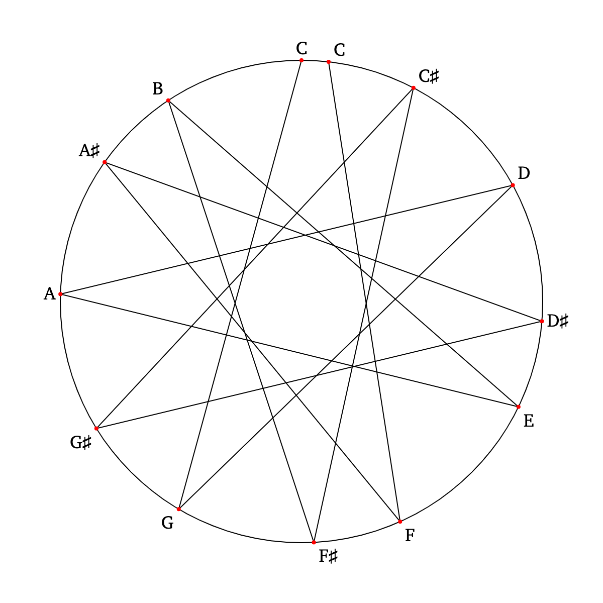
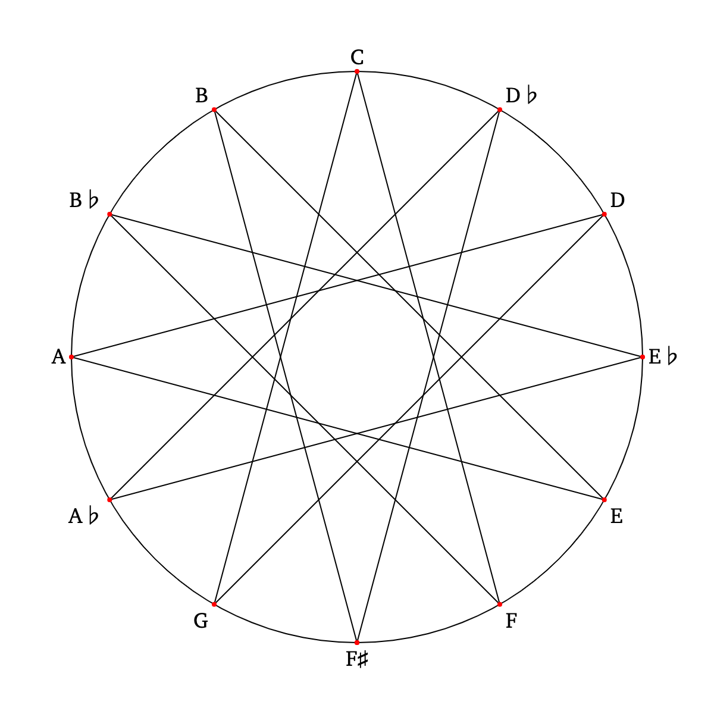
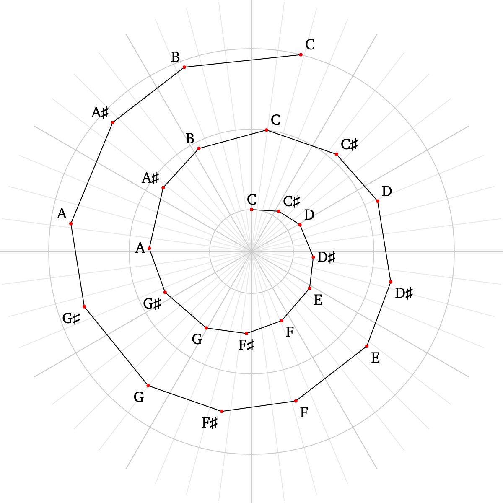
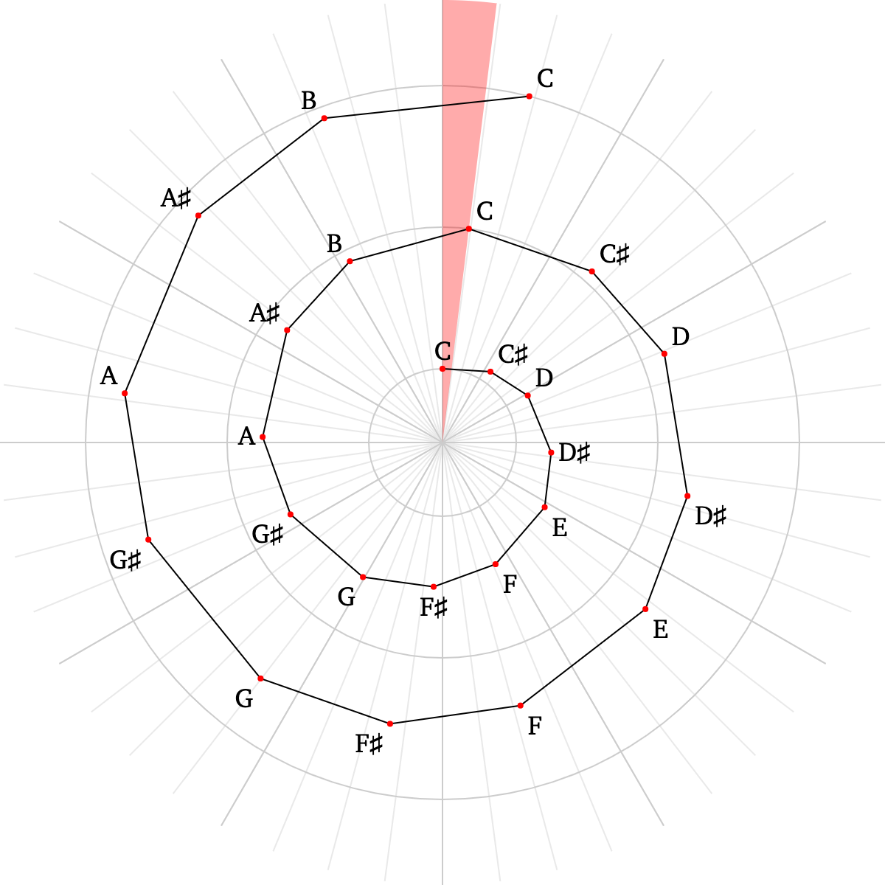

# 🎼 5thsview

**This is a JavaScript visualization exercise based on musical intervals of fifths.**

There are two different views, **⭕️ circle** and **🌀 spiral**, and three different scales, [**Pythagorean**](https://en.wikipedia.org/wiki/Pythagorean_tuning), [**5-limit just**](https://en.wikipedia.org/wiki/Five-limit_tuning) and [**12-tone equal temperament** (**ET**)](https://en.wikipedia.org/wiki/Equal_temperament).

Circle view displays an entire octave with note points along the circumference and segments connecting subsequent notes in an interval of fifths.
This forms an open or closed dodecagram (twelve points star) depending on the scale type. Pythagorean and just scale leave a gap, but ET closes the diagram.

<table>
    <tr>
        <td align="center">
            <figure>
                
                <figcaption>Pythagorean Scale (Circle View)</figcaption>
            </figure>
        </td>
        <td align="center">
            <figure>
                
                <figcaption>Just Scale (Circle View)</figcaption>
            </figure>
        </td>
        <td align="center">
            <figure>
                
                <figcaption>ET Scale (Circle View)</figcaption>
            </figure>
        </td>
    </tr>
</table>

This gap is known, again depending on the tuning, as [Pythagorean comma](https://en.wikipedia.org/wiki/Pythagorean_comma) or [Syntonic comma](https://en.wikipedia.org/wiki/Syntonic_comma).

Spiral view, spanning three octaves, is better in showing the comma as a wedge-shaped figure indicating the “offset” between subsequent octaves.

<table>
    <tr>
        <td align="center">
            <figure>
                
                <figcaption>Pythagorean Scale (Spiral View)</figcaption>
            </figure>
        </td>
        <td align="center">
            <figure>
                
                <figcaption>Pythagorean Scale with Comma (Spiral View)</figcaption>
            </figure>
        </td>
    </tr>
</table>
